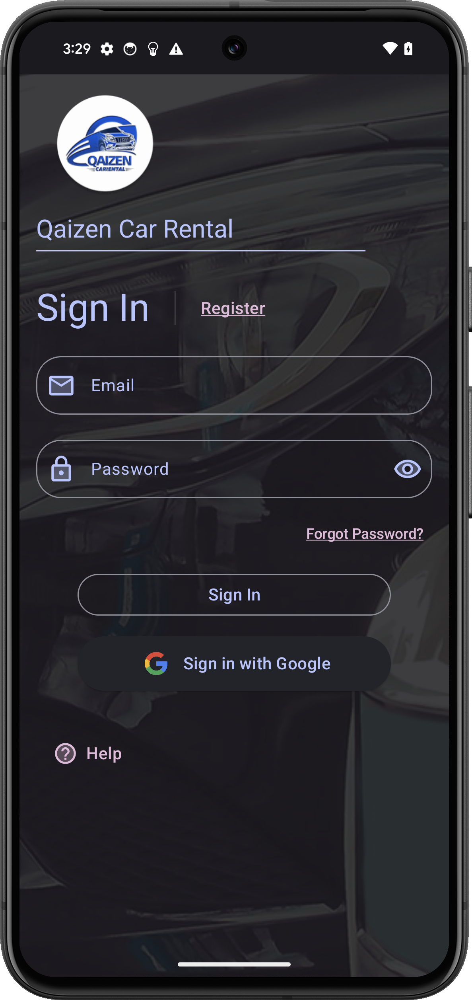
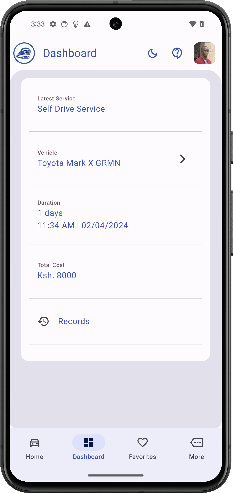
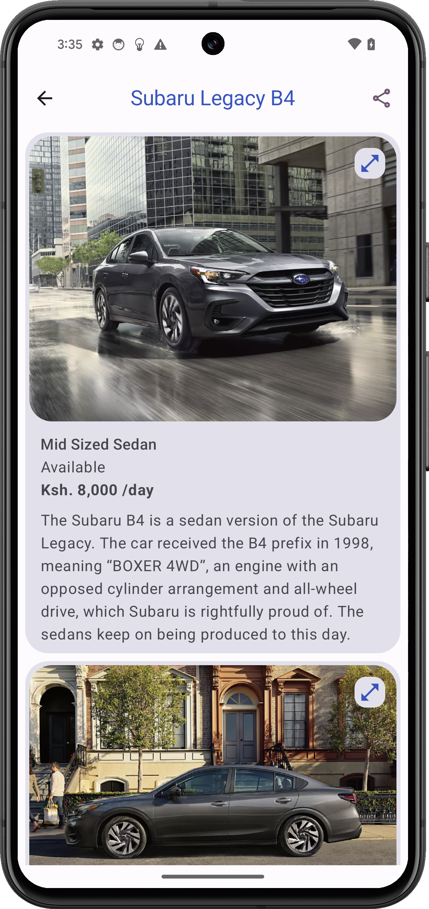
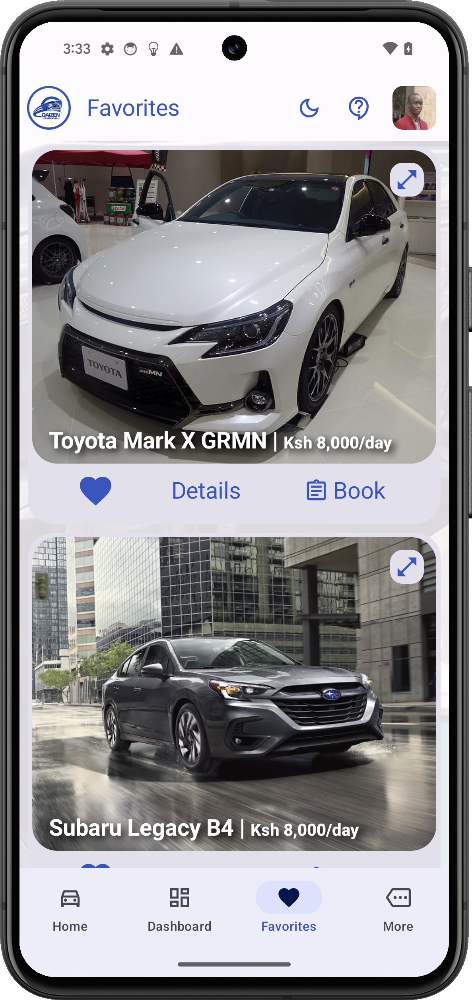
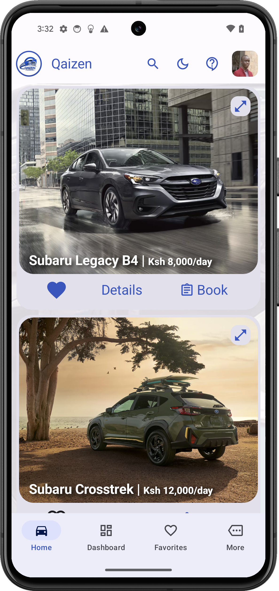
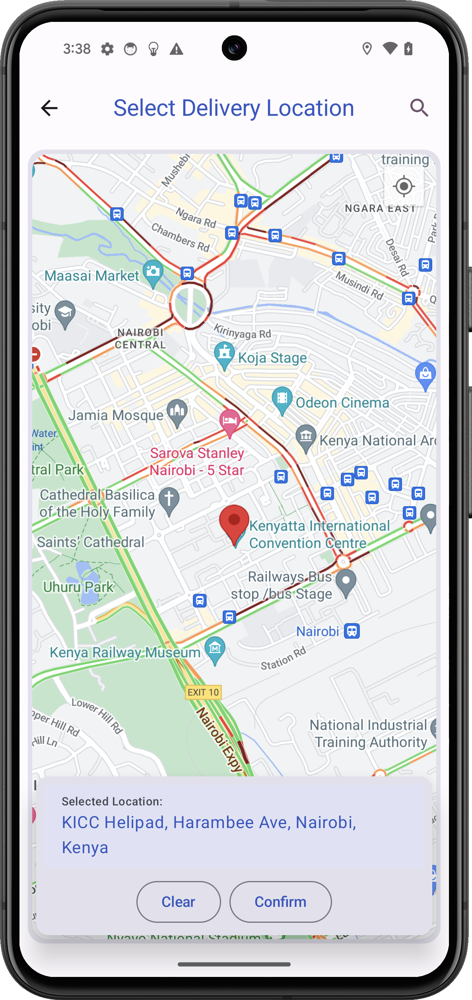
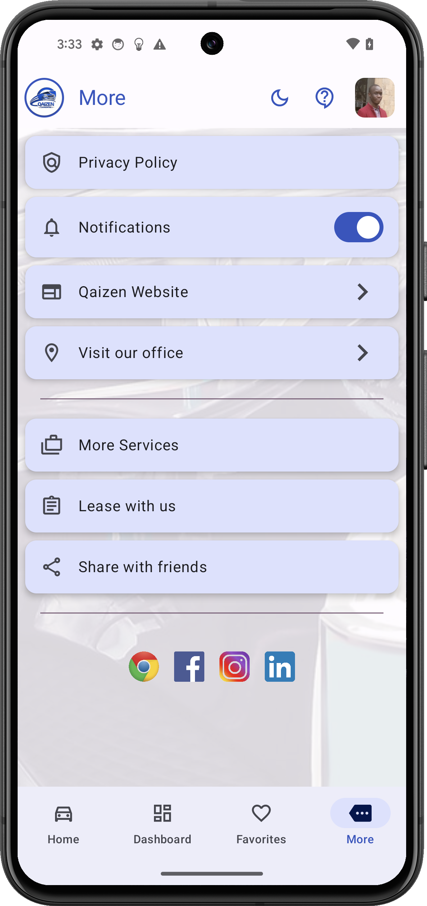
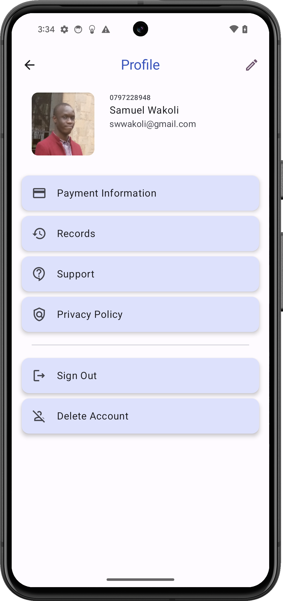
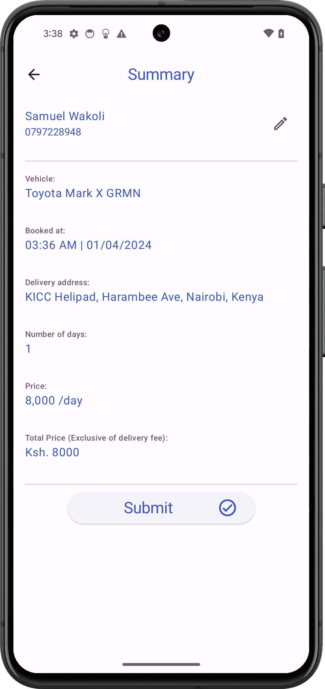
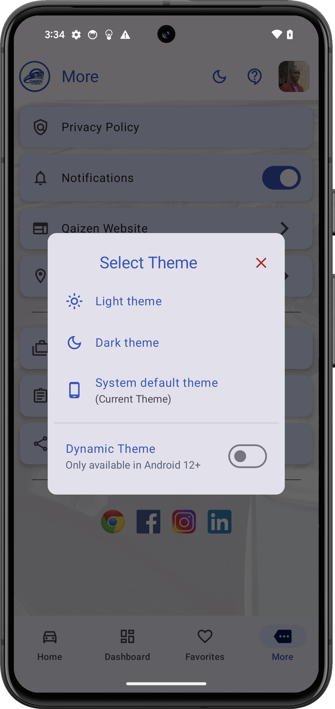

Qaizen Car Rental offers a seamless and professional solution for all your car rental needs. Our user-friendly app provides a wide selection of vehicles, including sedans, SUVs, and luxury cars, ensuring you find the perfect match. With customizable options for rental duration and convenient pickup and drop-off locations, we prioritize your convenience.

Your Trusted Partner for All Your Mobility Needs
- Chauffeured Service: Experience luxury and convenience with our professional chauffeurs at your service.
- Corporate Service: Elevate your business travel with our reliable corporate car rental solutions.
- Weddings and Events: Make your special day memorable with our elegant and reliable transportation services.
- Tours and Safaris: Explore exciting destinations with our reliable and comfortable vehicles for unforgettable tours and safaris.
- Hotel and Airport Transfers: Enjoy seamless transfers to and from hotels and airports, ensuring a stress-free start and end to your journey.
- Lease with us: Discover flexible leasing options tailored to your requirements.

                    

## Technologies Used
* Jetpack Compose
* Coil Image Loader
* Google Play Services Auth
* Firebase: Authentication, Firestore, Storage, Cloud Functions, Cloud Messaging
* Datastore Preferences

